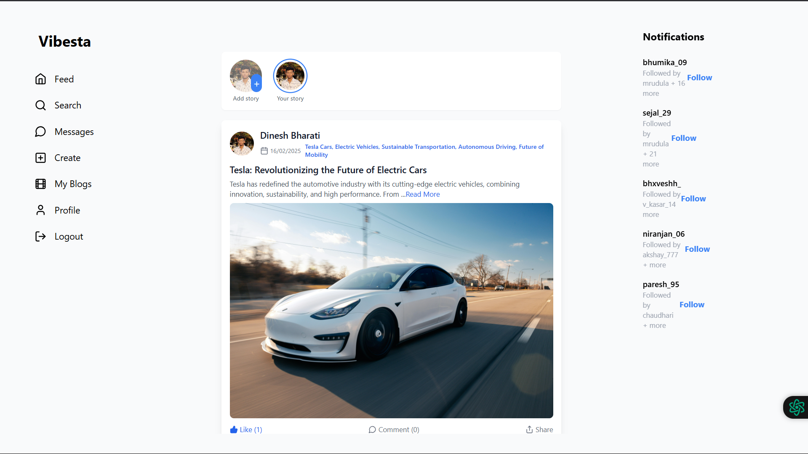
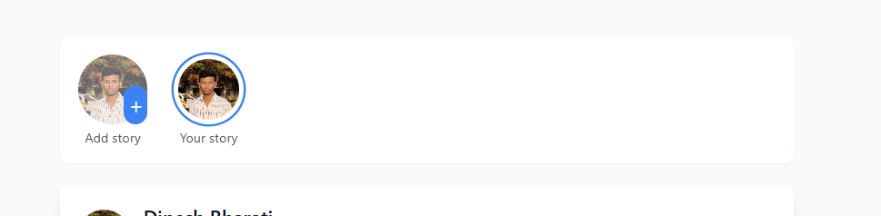
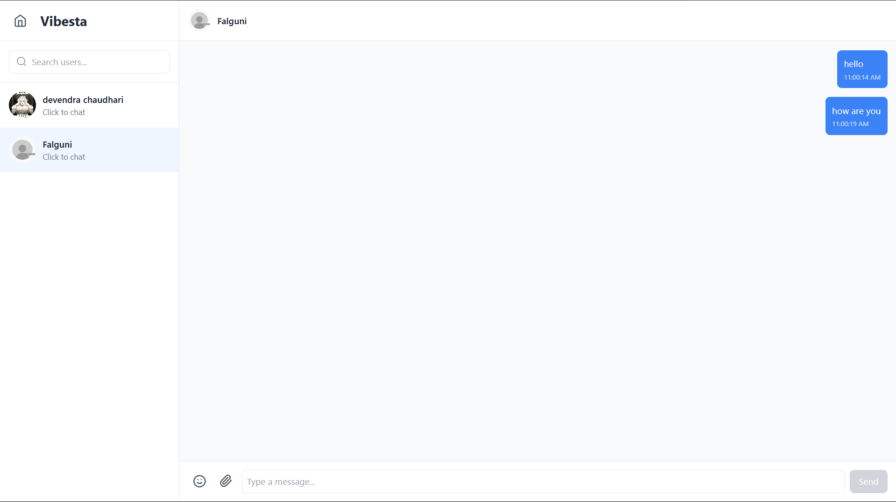
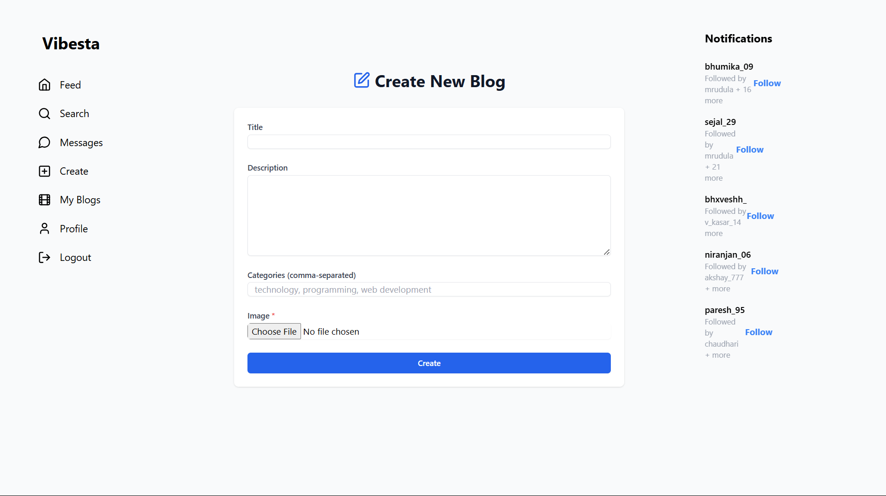
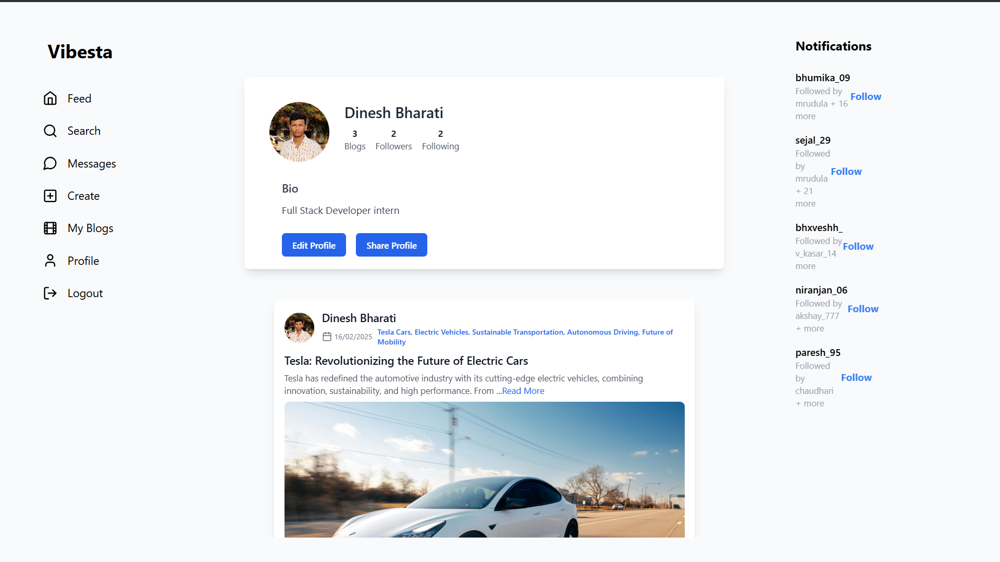
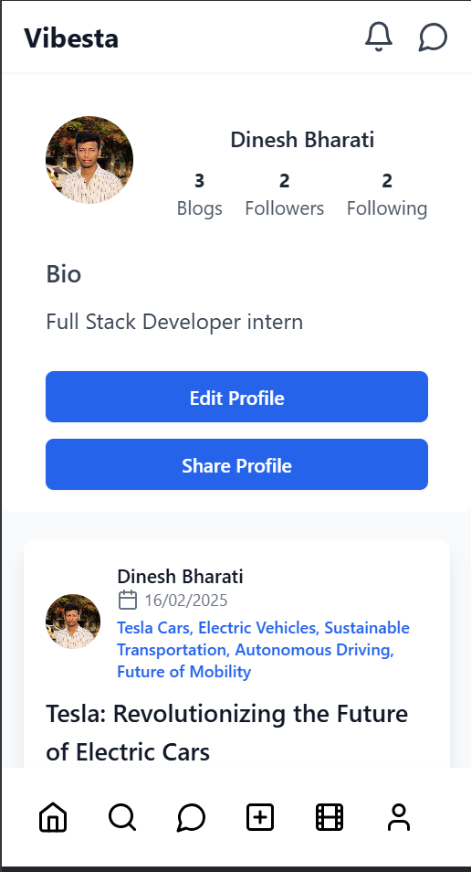
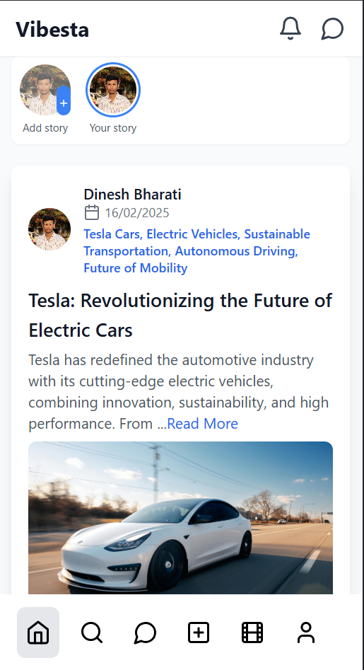

# Vibesta - Social Media Platform

A full-stack social media application built with the MERN stack (MongoDB, Express.js, React.js, Node.js) that allows users to share posts, stories, and interact with other users.

## Live Demo

🚀 [Visit Vibesta](https://social-media-app-seven-sand.vercel.app/)

## Table of Contents
- [Screenshots](#screenshots)
- [Features](#features)
- [Future Enhancements](#future-enhancements)
- [Tech Stack](#tech-stack)
- [Project Structure](#project-structure)
- [Getting Started](#getting-started)
- [API Documentation](#api-endpoints)
- [Contributing](#contributing)
- [License](#license)
- [Deployment](#deployment)
- [Troubleshooting](#troubleshooting)
- [Contact](#contact)
- [Support](#support)
- [Project Status](#project-status)
- [Credits](#credits)

## Screenshots

### Home Feed

*Main feed showing posts from followed users*

### Stories

*Stories feature with interactive viewer*

### Chat Interface

*Real-time chat with emoji support and file sharing*

### Create Post

*Create post with image upload and description*

### Profile Page

*User profile with customizable information*

### Mobile View

*Responsive design for mobile devices*

## Features

### Authentication
- User registration and login with JWT authentication
- Protected routes and middleware
- Profile management with customizable user information

### Posts & Stories
- Create, read, update, and delete posts (CRUD operations)
- Image upload support for posts
- 24-hour stories feature with automatic expiration
- Like and comment on posts
- Rich text support for post descriptions

### Social Features
- Follow/unfollow other users
- User search functionality
- Real-time notifications
- Profile customization
- News feed with posts from followed users

### User Interface
- Responsive design for mobile and desktop
- Modern UI with Tailwind CSS
- Story viewer with navigation controls
- Interactive post engagement

## Future Enhancements
- [ ] Voice and video calling
- [ ] Group chat functionality
- [ ] Post scheduling
- [ ] Advanced analytics dashboard
- [ ] Multi-language support
- [ ] Dark mode support
- [ ] PWA implementation

## Tech Stack

### Frontend
- React.js
- Redux Toolkit for state management
- React Router for navigation
- Tailwind CSS for styling
- Axios for API requests
- Lucide React for icons

### Backend
- Node.js
- Express.js
- MongoDB with Mongoose
- JWT for authentication
- Multer for file uploads
- Socket.io for real-time features

## Project Structure
├── backend/
│ ├── config/ # Database and other configurations
│ ├── controllers/ # Request handlers
│ ├── middleware/ # Custom middleware
│ ├── models/ # Database models
│ ├── routes/ # API routes
│ └── server.js # Entry point
├── src/
│ ├── components/ # React components
│ ├── store/ # Redux store and slices
│ ├── assets/ # Static assets
│ └── App.jsx # Root component
├── public/ # Static files
├── index.html # HTML template
├── package.json # Project configuration
├── README.md # Project documentation
└── .env # Environment variables

## Getting Started

### Prerequisites
- Node.js (v14 or higher)
- MongoDB
- npm or yarn

### Installation

1. Clone the repository
git clone https://github.com/dineshbharati27/social-media-app
cd social-media-app

2. Install dependencies
npm install

3. Install frontend dependencies
cd ../src
npm install

4. Create a .env file in the backend directory with the following variables:

MONGODB_URI=your_mongodb_connection_string
JWT_SECRET=your_jwt_secret
PORT=5000
CLOUDINARY_CLOUD_NAME=your_cloudinary_name
CLOUDINARY_API_KEY=your_api_key
CLOUDINARY_API_SECRET=your_api_secret

5. Start the development server

cd ../backend
npm start

6. Start the frontend development server

cd ../src
npm run dev

## API Endpoints

### Authentication
- `POST /api/users/register` - Register a new user
- `POST /api/users/login` - Login user
- `GET /api/users/profile` - Get user profile

### Posts
- `POST /api/blogs/create` - Create a new post
- `GET /api/blogs/all` - Get all posts
- `GET /api/blogs/user` - Get user's posts
- `PUT /api/blogs/:id` - Update a post
- `DELETE /api/blogs/:id` - Delete a post

### Stories
- `POST /api/stories/create` - Create a new story
- `GET /api/stories/feed` - Get stories feed
- `DELETE /api/stories/:id` - Delete a story

### Social
- `POST /api/users/follow/:userId` - Follow/unfollow user
- `PUT /api/blogs/like/:id` - Like/unlike post
- `PUT /api/blogs/comment/:id` - Comment on post

## Contributing

1. Fork the repository
2. Create your feature branch (`git checkout -b feature/AmazingFeature`)
3. Commit your changes (`git commit -m 'Add some AmazingFeature'`)
4. Push to the branch (`git push origin feature/AmazingFeature`)
5. Open a Pull Request

## License

This project is licensed under the ISC License - see the LICENSE file for details.

## Acknowledgments

- [React Documentation](https://reactjs.org/)
- [MongoDB Documentation](https://docs.mongodb.com/)
- [Express.js Documentation](https://expressjs.com/)
- [Node.js Documentation](https://nodejs.org/)
- [Tailwind CSS Documentation](https://tailwindcss.com/)

## Deployment

### Frontend Deployment (Vercel)
1. Fork this repository
2. Create a new project in Vercel
3. Connect your GitHub repository
4. Configure environment variables
5. Deploy!

### Backend Deployment (Railway)
1. Create a new project in Railway
2. Connect your GitHub repository
3. Configure environment variables
4. Set up MongoDB add-on
5. Deploy!

## Troubleshooting

### Common Issues
1. **Connection Issues**
   - Check MongoDB connection string
   - Verify environment variables
   - Ensure correct port configuration

2. **Upload Problems**
   - Check file size limits
   - Verify Cloudinary configuration
   - Ensure proper permissions

3. **Authentication Issues**
   - Clear browser cache
   - Check token expiration
   - Verify credentials

## Contact

- **Developer**: Dinesh Bharati
- **Email**: dineshgbharati@gmail.com
- **LinkedIn**: [Dinesh Bharati](https://linkedin.com/in/dinesh-bharati)

## Support

If you find this project helpful, please consider:
- Giving it a ⭐ on GitHub
- Sharing it with friends
- Contributing to its improvement

## Project Status

Current Version: 1.0.0
Last Updated: February 2025
Status: Active Development

## Credits

### Libraries Used
- [React.js](https://reactjs.org/)
- [Redux Toolkit](https://redux-toolkit.js.org/)
- [Tailwind CSS](https://tailwindcss.com/)
- [Socket.io](https://socket.io/)
- [Mongoose](https://mongoosejs.com/)

### Special Thanks
- Open source community
- Beta testers
- Contributors
